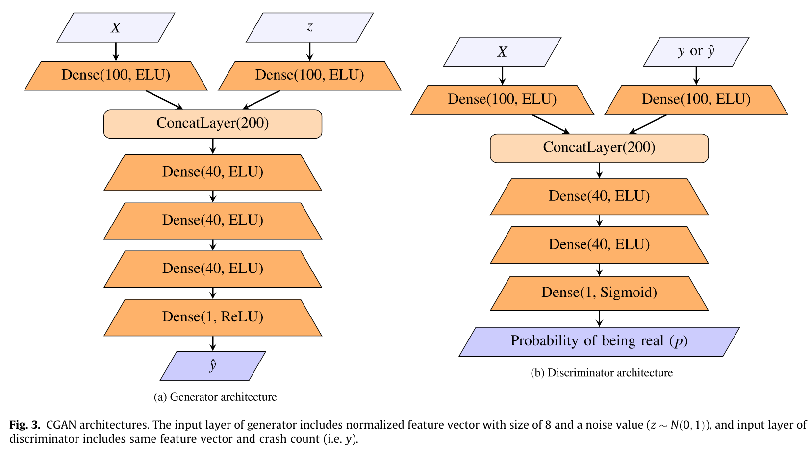
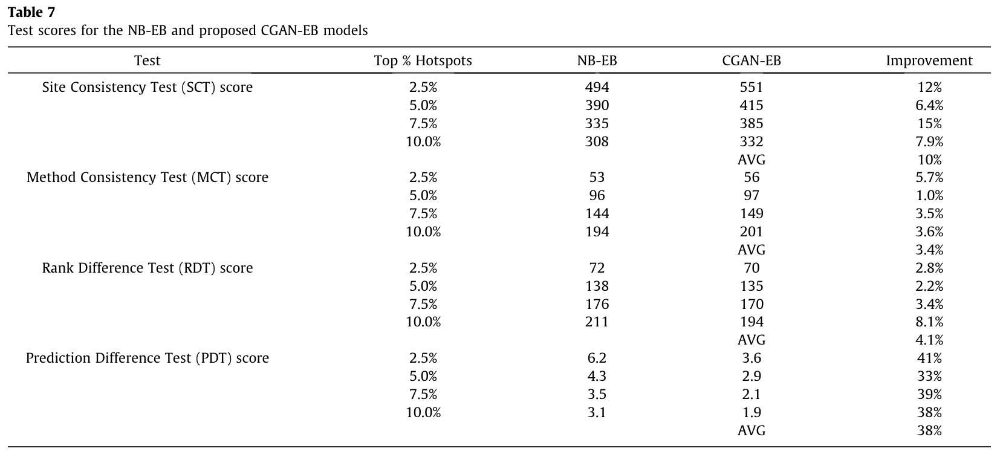

# Code for paper: CGAN-EB: A non-parametric empirical Bayes method for crash frequency modeling using conditional generative adversarial networks as safety performance functions
link to paper with simulated crash data: https://arxiv.org/abs/2112.06925
linkto paper with real-world crash data: https://www.sciencedirect.com/science/article/pii/S2046043022000594

## Abstract
The empirical Bayes (EB) method based on parametric statistical models such as the negative binomial (NB) has been widely used for ranking sites in the road network safety screening process. In this paper a novel non-parametric EB method for modeling crash frequency data based on Conditional Generative Adversarial Networks (CGAN) is proposed and evaluated over a real-world crash data set. Unlike parametric approaches, there is no need for a pre-specified underlying relationship between dependent and independent variables in the proposed CGAN-EB and they are able to model any types of distributions. The proposed methodology is applied to real-world and simulated crash data sets. The performance of CGAN-EB in terms of model fit, predictive performance and network screening outcomes is compared with the conventional approach (NB-EB) as a benchmark. The results indicate that the proposed CGAN-EB approach outperforms NB-EB in terms of prediction power and hotspot identification tests.

## Snapshots from the paper

